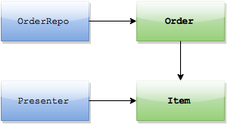

# Architecture and Philosophy

`yep-app` encourages an architecture that separates the core logic of the application from the "details". In addition, the `App` class requires a list of components, thus promoting a [component based architecture.](https://msdn.microsoft.com/en-us/library/ee658117.aspx#ComponentBasedStyle)

## What do you mean by "core logic"?
A feature, module, functionality should be written without concerns of the details. This might not always be possible but it is a preferable way to start development, as it most likely that those details will change.

We recommend an approach where you first identity your use cases from requirements. Let's say our system needs to add an item to shopping. Our first use case might be to *add an item to the shopping*.

We will represent the use case with an [Action](./app-actions-and-events.md), which is simply a command object. We will call this `AddItemToOrder`. While exploring this use case we find we need the following objects: `Order` and `Item`. We also will need to fetch and save this data to some storage object, and probably notify the user the item was successfully saved.

We come up with the following:



The blue objects live on the boundary of our system (the presenter neat the UI, and the repo near the data). The green objects are our models. So *the green objects plus the action object* are what we mean by "core logic". The don't care much about the blue objects, in fact the core objects define the interfaces they would like the boundary (blue) objects to implement. This keeps the core of your component unnecessarily coupled to details.

## Decomposing your feature

The action coordinates between these objects to fulfill the task of *adding an item to an order*.

These objects will probably be package as a component: probably `OrderComponent`. We can break this component into layers:
```
node_modules/@app/order
    lib/
        actions/
            AddItemToOrder.js
        models/
            Order.js
            OrderItem.js
    test/
        OrderTest.js
        OrderItemTest.js
        AddItemToOrderTest.js
    index.js  <- entry point of our component.
```

This above only includes the "core logic", the green objects and our unit test. When writing the unit tests we will define the interfaces we expect from our boundary objects.

Based on our unit tests (especially the unit test for the action) we come up with the following interfaces:

```typescript
interface OrderRepo {
    fetchOrderById(id: string);
    createItem(data: object);
}

interface OrderPresenter {
    showError(err);
    showItemAddedMessage();
}
```

At this point we can know begin at implementing these objects.
We can decide to decouple them from our component if we feel they are volatile and likely to change, or we can put them in our component for now, and defer that decision to when our component is more stable.

Our component then looks like this.

```
node_modules/@app/order
    lib/
        actions/
            AddItemToOrder.js
        models/
            Order.js
            OrderItem.js
        repos/
             OrdersInStorage.js
        ui/
            OrderPage.js
            OrderForm.js
            BannerMessage.js
    test/
        OrderTest.js
        OrderItemTest.js
        AddItemToOrderTest.js
    index.js  <- entry point of our component.
```

If your boundary objects have enough logic, then it might be a good idea to write tests for them. In the above we have two objects. The form object will implement the `Presenter` and must contain both `showError` and `showItemAddedMessage`. It can use whatever UI framework it likes to achieve this (react, angular, knockout, etc).
The repo is implemented using HTML local storage, however it does this, it *MUST* have a `fetchOrderById` method and `createItem` method.

## Useful Resources
This architecture is based on the following similar models:

- [Hexagonal (Ports and Adapters)](http://alistair.cockburn.us/Hexagonal+architecture)
- [Clean Architecture](https://blog.8thlight.com/uncle-bob/2012/08/13/the-clean-architecture.html)
- [Onion Architecture](http://jeffreypalermo.com/blog/the-onion-architecture-part-1/)
